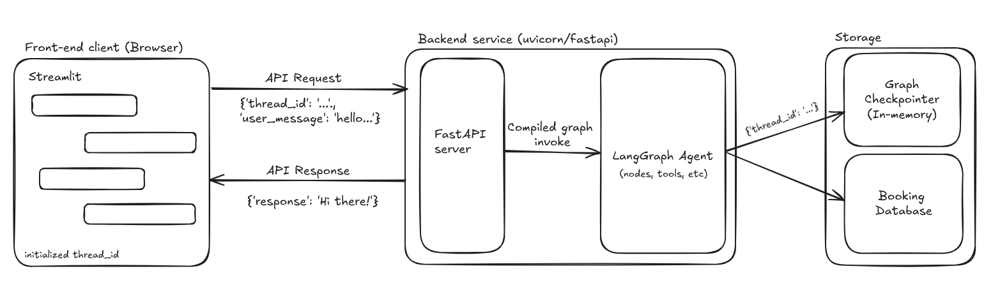

# Meet Michelle, the appointment manager assistant

This repository contains a working prototype of Michelle, an appointment management agent for Shine & Style, a local hair salon. Built using **LangGraph**, **Streamlit**, and **OpenAI** models, this project showcases a conversational assistant capable of handling salon bookings.

Please note that this a work in progress (its Version0), and serves as an early-stage prototype. The goal is to eventually evolve it into a production-ready system. The current system can currently book, reschedule and cancel appointments.

## In progress
- [X] Appointment rescheduling or cancellation features.
- [X] Decouple LangGraph agent (backend) from Streamlit (frontend); expose the backend as a containerized FastAPI endpoint.
- [ ] Answer FAQ questions about the salon timings, etc
- [ ] Allow to book with specific stylists at the salon (as is the case with certain well-known salons).
- [ ] Make SQL backend (checking availability) more efficient to handle lots of appointment requests.
- [ ] Make this a voice agent eventually for practical applications.

## Simple System Design


## Get started
### 1. Setting Up Backend Service
1. **Install Requirements**: Make sure you have Python 3.10+ installed. Then run:
	```bash
	pip install -r backend_service_requirements.txt
	```
2. **Setting Up Environment Variables:** Set up your `OPENAI_API_KEY` environment variable.
3. **Run the service:** Run the following command to start the backend service:
	```bash
	python src/run_service.py
	```
Running the service would create a new sqlite database file `bookings.sqlite` in the current directory if it doesn't exist.

### 2. Setting up Front-End (Streamlit)
1. **Install Requirements**: Make sure you have Python 3.10+ installed. Then run:
	```bash
	pip install -r frontend_requirements.txt
	```
2. **Run the service:** Run the following command to start the Streamlit front-end:
	```bash
	streamlit run src/streamlit_app.py
	```
The app will open in your browser at http://localhost:8501 by default.

## Disclaimer

This is a work-in-progress project and not suitable for production use yet. Features may be incomplete, and the codebase is subject to frequent changes.
